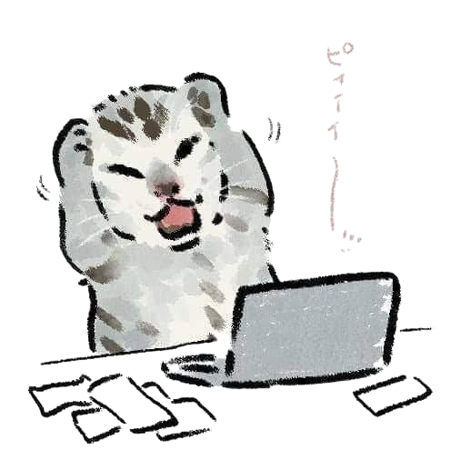

  

<h1 align="center">Hi 👋, Im valeee</h1>

<h3 align="center">AI engineer student</h3>

  

  

**valeee**, Here  — AI engineering student passionate about software development. I have worked with Python, Django, and PostgreSQL on projects such as data management systems, role-based authentication, dashboards, and REST APIs, as well as Access databases and Excel automation using openpyxl. I am interested in robotics and creative coding, including interactive animations in p5.js. Founder of UsagiCode, a community focused on programming, web development, cybersecurity, and AI.

 

 

  

  
  &nbsp;&nbsp;&nbsp;
  
  &nbsp;&nbsp;&nbsp;
  

  

  

  

<h2 align="center">📈 Activity Graph</h2>

//

### 
<h2 align="center">⌘ Commit Activity</h2>

<picture>
  <source media="(prefers-color-scheme: dark)"
    srcset="https://raw.githubusercontent.com/midnightshady/midnightshady/output/pacman-contribution-graph-dark.svg">

  <source media="(prefers-color-scheme: light)"
    srcset="https://raw.githubusercontent.com/midnightshady/midnightshady/output/pacman-contribution-graph.svg">

  

<h2 align="center">⌘ Philosophy</h2>

  

  

<!-- Proudly created with GPRM ( https://gprm.itsvg.in ) -->
